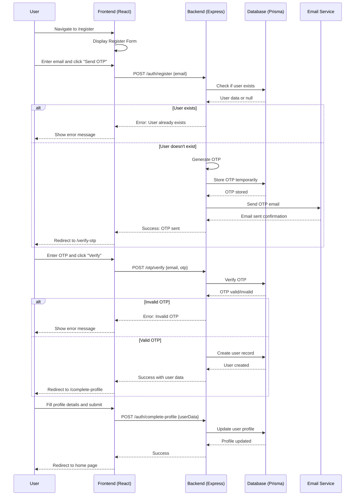
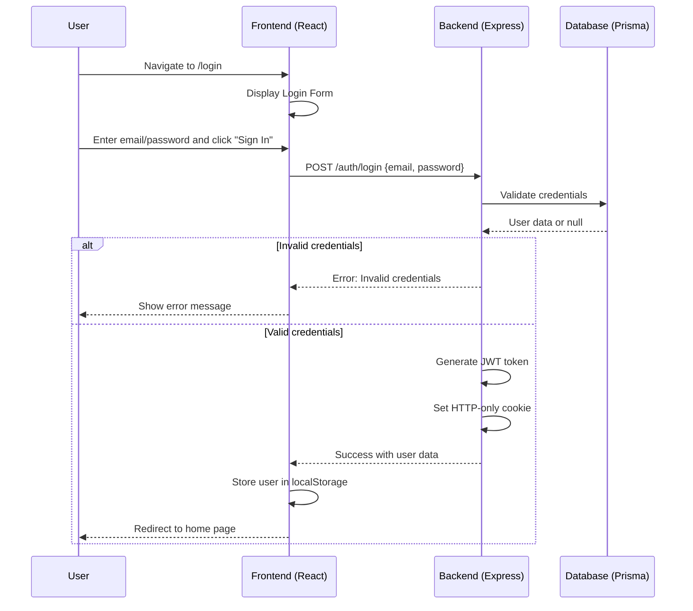
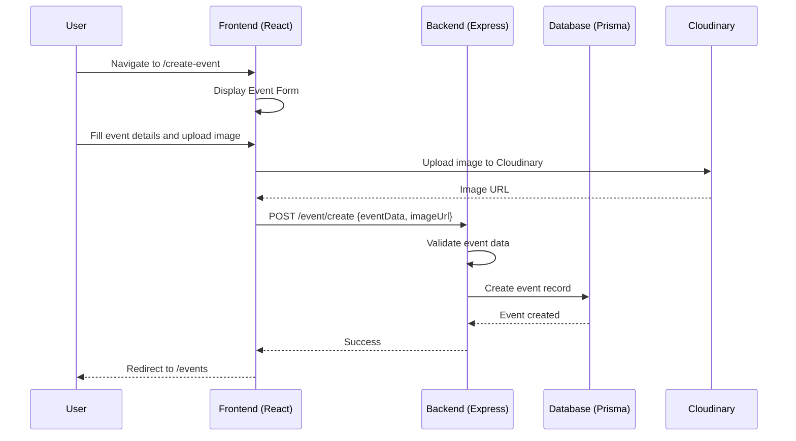
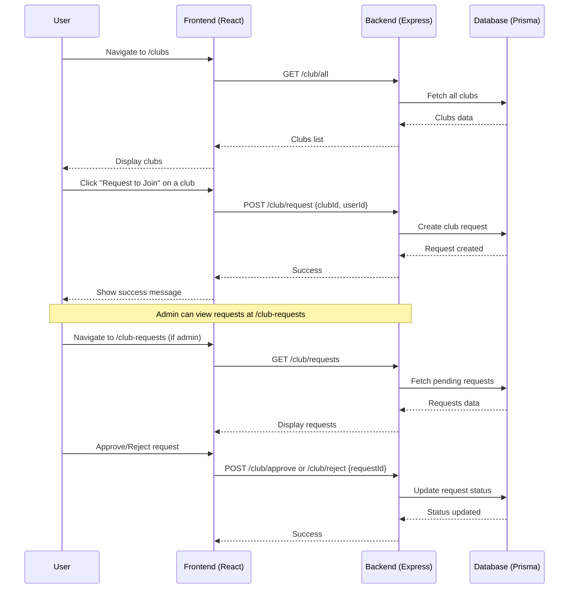
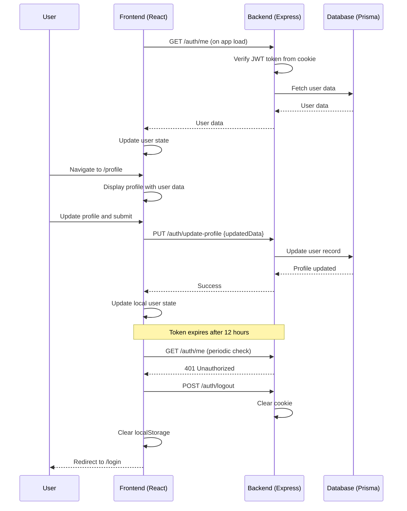
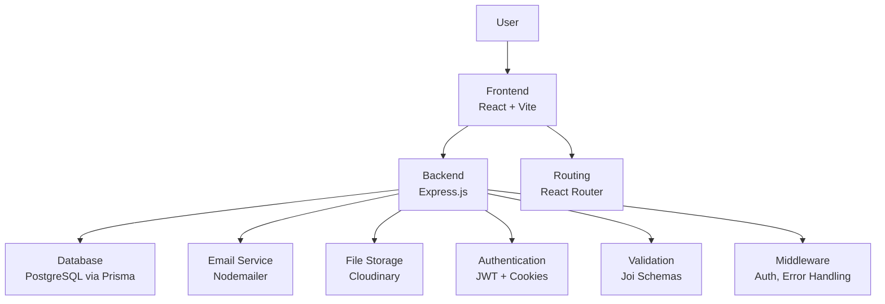

# CampusConnect Sequence Diagram

This document contains the sequence diagram for the CampusConnect project, illustrating the main user flows and interactions between components.

## Main User Flows

### 1. User Registration Flow

### 2. User Login Flow

### 3. Event Creation Flow

### 4. Club Management Flow

### 5. Profile and Authentication Management

## System Architecture Overview

## Key Components

- **Frontend**: React application with routing, forms, and API integration
- **Backend**: Express.js server with RESTful APIs
- **Database**: PostgreSQL with Prisma ORM
- **Authentication**: JWT tokens stored in HTTP-only cookies
- **Email**: Nodemailer for OTP delivery
- **File Upload**: Multer for handling file uploads, Cloudinary for storage
- **Validation**: Joi schemas for input validation
- **Error Handling**: Centralized error handling middleware

This sequence diagram covers the main user journeys in the CampusConnect application, showing how users can register, login, create events, manage clubs, and maintain their profiles.